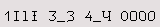
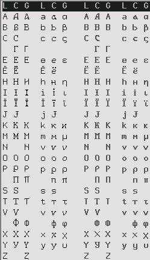
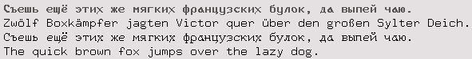
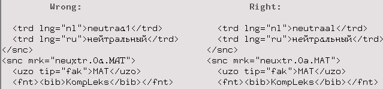

# A Unicode Font Disambiguation
## by Sergei B. Pokrovsky

## Russian/English Alphabet Disambiguation

-------

### Explanation

The *Civil Cyrillic Alphabet*, introduced by Peter the Great, makes many
Russian letters look like some Latin ones; this is a nuisance for the
programmers: what looks identical on the screen can be quite different
in the code; moreover, some letters are identical in one case (T,Т
y,у) and different in the other (t,т Y,У).  The Western programmers
know a similar problem with O/0 and 1/l/I disambiguation.

In a Unicode font the problem is even worse, because the
Latin/Cyrillic ambiguity is complicated with the Greek. Still, I've
tried to modify a couple of the bitmapped BDF [Unicode fonts by Markus
Kuhn](http://www.cl.cam.ac.uk/~mgk25/ucs-fonts.html) which I use on
Sparc computers so that I can see the difference and guess which
alphabet a given letter belongs to. Actually these are 9x18 fonts in
the plain and bold flavors:

  `-Pok-Fixed-Medium-R-Normal--18-120-100-100-C-90-ISO10646-1`  
  `-Pok-Fixed-Medium-R-Bold--18-120-100-100-C-90-ISO10646-1`

Markus Kuhn, the initiator of the project, dislikes this idea. He
wrote in his advice to contributors:

> Always look first at existing similar characters in order to
> preserve a consistent look and feel for the entire font and
> within the font family.

In principle this is reasonable, provided that “consistent” does not
imply “identical”. The *Gill Sans* font is extremely consistent in
that it identifies `1Il` as well as `Oo`; here is a specimen
[from Wikipedia](https://en.wikipedia.org/wiki/Gill_Sans):

But this is unacceptable in a programmer font, and the `fixed` font
family in question makes the corresponding glyphs distinguishable.
Similarly the English “a copy” should be distinguishable from the
Russian “а сору” (e.g. «а сору было много») — such words are often
confused in automatic text recognition and require manual correction).

### Screenshots
 * Digit/letter disambiguation:  
     
   (I've modified the glyphs `1` and the `4`: I've removed the serif under
   1, and opened the 4; that is not essential for the purpose of
   disambiguation, it is a matter of personal preference.) 

* Latin-Cyrillic-Greek disambiguation (in normal and bold weights):  
  
 * Text samples:  
   
 * Making the difference visible:  
     
   Note that a wrong letter in a translation may go undetected by an
   automatic validator, and make unusable the index entry based on it
   (e.g. in an e-book).

## Make
    cd GIT/fixed-9x18/src
    make

This shall produce `9x18.pcf.gz` (normal weight) and `9x18B.pcf.gz` (bold).

## Install
The easiest way is to overwrite the 2 homonimous files from the
`xfonts-base` package in the standard `/usr/share/fonts/X11/misc/`
directory. Just say

    sudo make install

(this is the default).

Or you could prefer to add the new fonts in a system-wide manner, e.g.
put them into `/usr/local/share/fonts/fixed`; you can do it with
   
    make install whereto="/usr/local/share/fonts/fixed"

Or you could install them locally, just for the current user; the
usual locations are `~/.fonts` (obsolete and deprecated) and
`~/.local/share/fonts`. Hence, say e.g.

    make install whereto="~/.local/share/fonts"

The problem of these non-default locations is that not all systems
have them in the Xorg font path. You may check it with

    xset -q | grep -A1 Font

If the chosen destination is missing in the list, you have to add it
into your `~/.xinitrc` or the startup file of your window system:

    xset +fp /usr/local/share/fonts/fixed

or

    xset +fp ~/.fonts

<!--
https://wiki.archlinux.org/index.php/Fonts#Installation

Some newer Linuces (e.g. Ubuntu 18) restrict usability of the BDF
fonts. Theoretically the user is supposed to be able to make them
available by manipulating the `/etc/fonts/conf.d/` directory as
described in [Ubuntu
Wiki](https://wiki.ubuntu.com/Fonts#Enabling_Bitmapped_Fonts) (or
possibly in your local `/usr/share/doc/fontconfig/README.Debian`);
unfortunately this recipe does not work for me nor for many other
users.

The workaround I've used is to replace the standard
`/usr/share/fonts/X11/misc/9x18*.pcf.gz` fonts with their
[disambiguated version](misc.tar), and then:
    sudo mkfontdir /usr/share/fonts/X11/misc
    sudo dpkg-reconfigure fontconfig -->

Hopefully thereafter you should be able to see the installed fonts
by the means of

    xfd -fn '-Pok-fixed-medium-r-normal--18-120-100-100-c-90-iso10646-1' &
    xfontsel -pattern '-Pok-Fixed-*-R-Normal--18-120-100-100-C-90-*-*' &
     
## License
The fonts are in the Public Domain, as described in the
[Debian
repository](https://salsa.debian.org/installer-team/console-setup/blob/master/copyright.fonts)
([SIL Open Font License, Version 1.1](SIL_Licence.txt)).

<!-- 
Cit: https://github.com/hzeller/rpi-rgb-led-matrix/commits/master/fonts/README

TAGS: font bitmap-font programming-font monospaced finding-glyphs -->
<!-- unicode cyrillic-characters terminal
-->
